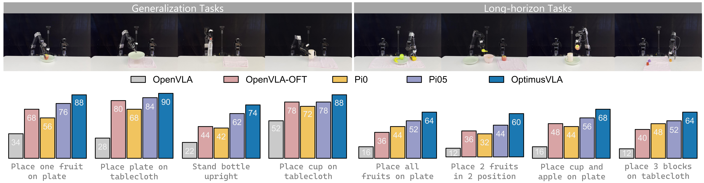

<h2 align="center">
    <b>Global Prior Meets Local Consistency: Dual-Memory Augmented  
        Vision-Language-Action Model for Efficient Robotic Manipulation
     CVPR 2026 </b> 
</h2>

<a target="_blank" href="https://scholar.google.com/citations?user=TDBF2UoAAAAJ&hl=en&oi=ao">Zaijing&#160;Li</a>1 2,
<a target="_blank" href="https://scholar.google.com/citations?user=rxaiRMUAAAAJ&hl=en">Bing&#160;Hu</a>1,
<a target="_blank" href="https://scholar.google.com/citations?user=9Vc--XsAAAAJ&hl=en&oi=ao">Rui&#160;Shao</a>1 3&#9993,
<a target="_blank" href="https://scholar.google.com/citations?user=Mpg0w3cAAAAJ&hl=en&oi=ao">Gongwei&#160;Chen</a>1,
 
<a target="_blank" href="https://scholar.google.com/citations?hl=en&user=Awsue7sAAAAJ">Dongmei&#160;Jiang</a>2&#9993,
 <a target="_blank" href="https://scholar.google.com/citations?hl=en&user=yywVMhUAAAAJ">Liqiang&#160;Nie</a>1

1Harbin Institute of Technology, Shenzhen&#160&#160&#160
2PengCheng Laboratory, Shenzhen&#160&#160&#160
3Shenzhen Loop Area Institute
 
&#9993&#160;Corresponding author&#160;&#160;
 

    
    

## :new: Updates
- [02/2026] :fire: OptimusVLA is accepted to **CVPR 2026**!
- [02/2026] :fire: [Project page](https://cybertronagent.github.io/OptimusVLA.github.io/) released.
- [02/2026] :fire: [Arxiv paper](https://arxiv.org/abs/2408.03615) released.

## :balloon: OptimusVLA Framework
Overview of OptimusVLA framework. Given a task and the current observation, the Vision–Language backbone first encodes the inputs into a multimodal representation. GPM then retrieves a task-level prior based on this representation, while LBM dynamically encodes the historical action sequence to produce a consistency constraint. Finally, the flow policy denoises the initialization with an adaptive NFEs schedule to generate the action chunk.

## :smile_cat: Evaluation results on Real World
We evaluate OptimusVLA on Generalization Tasks and Long-horizon Tasks via GALAXEA R1 Lite robot.

